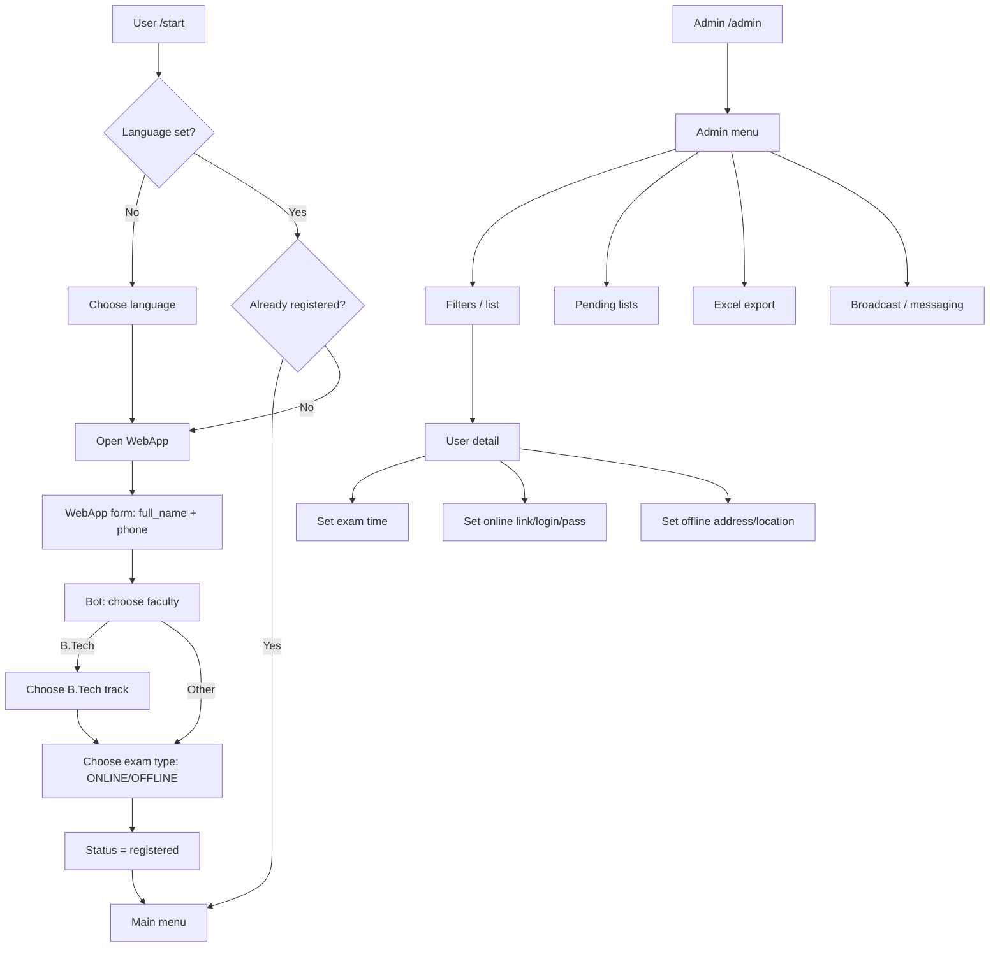

# Sharda Registration (Telegram Bot + WebApp)

**Sharda Registration** — Sharda University Uzbekistan abituriyentlarini **Telegram bot** orqali ro‘yxatdan o‘tkazish va adminlar uchun **boshqaruv paneli** (Telegram ichida) taqdim etuvchi loyiha. Foydalanuvchidan asosiy ma’lumotlar **Telegram WebApp** (mini web-form) orqali olinadi, keyingi bosqichlar esa bot orqali davom etadi.

> **Til qo‘llab-quvvatlash:** Uzbek (uz), Russian (ru), English (en)  
> **DB:** MongoDB (Motor)  
> **Bot framework:** Aiogram 3

---

## Synopsis

- Abituriyent **/start** qiladi → til tanlaydi → WebApp’da **F.I.Sh** va **telefon** kiritadi.
- Bot keyin **fakultet** (va B.Tech bo‘lsa yo‘nalish) + **imtihon turi (online/offline)** ni tanlatadi.
- Adminlar Telegram ichida:
  - abituriyentlar ro‘yxatini **filter** bilan ko‘radi,
  - abituriyentga **imtihon vaqti** va (online/offline) bo‘yicha kerakli ma’lumotlarni biriktiradi,
  - **pending** (vaqt/link/login-parol/address yetishmaydiganlar) bo‘yicha alohida ro‘yxatlar,
  - **Excel export**,
  - **broadcast / messaging**.

---

## Asosiy imkoniyatlar

### Abituriyent (User)
- /start → til tanlash (uz/ru/en)
- WebApp orqali:
  - Full name
  - Phone
- Bot orqali:
  - Fakultet tanlash (BBA/BSC/BAAE/B.Tech)
  - B.Tech bo‘lsa yo‘nalish (CSE/AIML/CYBER)
  - Imtihon turi (ONLINE/OFFLINE)
- Menyu:
  - Profil
  - Imtihon ma’lumotlari
  - Sozlamalar (tilni almashtirish)

### Admin
- /admin menyu
- Abituriyentlar ro‘yxatini filterlash:
  - Fakultet (Any/BBA/BSC/BAAE/B.Tech)
  - Imtihon turi (Any/Online/Offline)
  - Status (Any/Registered/Draft)
- Abituriyent detail:
  - Imtihon vaqti (TEXT) + UTC hisoblash
  - ONLINE: link, login, parol
  - OFFLINE: address, location (lat,lng)
- Pending ro‘yxatlar:
  - TIME (imtihon vaqti yo‘q)
  - CREDS (online credentials/link yo‘q)
  - ADDR (offline address yo‘q)
  - ALL (umumiy)
- Excel export:
  - filterlar + credentials qo‘shish/qo‘shmaslik
- Admin messaging/broadcast (target bo‘yicha yuborish)

---

## Texnologiyalar

- **Python 3.11**
- **Aiogram 3**
- **MongoDB** + **Motor (async)**
- **Pydantic Settings** (.env konfiguratsiya)
- **OpenPyXL** (Excel export)
- **WebApp:** HTML/CSS/Vanilla JS (build stepsiz)

---

## Arxitektura



---

## Papkalar strukturası

```
.
├─ app/
│  ├─ bot.py                # Entry point (polling)
│  ├─ config.py             # Pydantic Settings (.env)
│  ├─ db/
│  │  ├─ mongo.py           # Mongo client
│  │  └─ repos/             # Mongo repositories (users/admins/candidates)
│  ├─ i18n/                 # uz/ru/en JSON translations
│  ├─ keyboards/            # inline/reply keyboards (user + admin)
│  ├─ middlewares/          # role + i18n middlewares
│  ├─ routers/              # handlers (user + admin + registration)
│  ├─ scheduler/            # reminder loop (30 min before)
│  ├─ services/             # (excel_export.py ishlatiladi)
│  ├─ utils/                # helpers (datetime parse, safe edit, etc.)
│  └─ webapp/               # static WebApp (index.html/app.js/styles.css)
├─ tmp_exports/             # Excel eksport fayllari shu yerga tushadi
├─ .env.example             # config namuna (secrets bo‘lmasligi kerak)
└─ Pipfile / Pipfile.lock   # pipenv dependencies
```

---

## Konfiguratsiya (.env)

Loyiha root papkada `.env` faylni o‘qiydi.

Minimal `.env`:

```env
BOT_TOKEN=123456:ABC-DEF...
MONGO_URI=mongodb+srv://<user>:<pass>@<cluster>/<db>?retryWrites=true&w=majority
MONGO_DB=sharda_bot
SUPER_ADMIN_TG_ID=123456789
WEBAPP_URL=https://your-domain.com/sharda-webapp/index.html
TZ=Asia/Tashkent
INTRO_PHOTO_FILE_ID=
```

**Izohlar:**
- `SUPER_ADMIN_TG_ID` — birinchi super admin Telegram ID (bot ishga tushganda DBga `role=super` qilib qo‘yiladi).
- `WEBAPP_URL` — WebApp statik fayllari joylashgan URL. Bot WebApp tugmasiga `?lang=uz|ru|en` qo‘shib yuboradi.
- `INTRO_PHOTO_FILE_ID` — (ixtiyoriy) intro uchun Telegram file_id (agar ishlatsangiz).

⚠️ **Xavfsizlik:** `.env.example` ichiga real token/DB parol qo‘ymang. Agar qo‘yib yuborilgan bo‘lsa — **token/parollarni darhol rotate qiling**.

---

## Lokal ishga tushirish (Development)

### 1) Talablar
- Python **3.11**
- Pipenv (`pip install pipenv`)
- MongoDB (lokal yoki Atlas)

### 2) Install
```bash
pipenv install
```

### 3) Environment
```bash
cp .env.example .env
# .env ichini to‘ldiring
```

### 4) Botni ishga tushirish
```bash
pipenv run python app/bot.py
```

### 5) WebApp’ni lokal test qilish
WebApp build qilinmaydi — statik fayl.

Oddiy test:
```bash
cd app/webapp
python -m http.server 8080
```

Keyin `.env` ichida:
```env
WEBAPP_URL=http://<YOUR_IP>:8080/index.html
```

> Telegram WebApp odatda **HTTPS** talab qiladi (production’da albatta HTTPS).

---

## BotFather sozlash (WebApp)

Telegram WebApp ishlashi uchun quyidagilarni tekshiring:
- BotFather → **Domain** (WebApp domain) ni set qiling (hosting domeningiz).
- BotFather → **Menu Button** (yoki keyboard orqali) WebApp URL ishlatiladi.
- `WEBAPP_URL` domeni BotFather’da ruxsat berilgan domen bilan mos bo‘lsin.

---

## Production (Server) uchun tavsiya

### Variant A) Polling + systemd (eng sodda)
1) Serverga kodni joylang (masalan `/opt/sharda_registration`)
2) Virtual env / pipenv install
3) `.env` ni serverda saqlang (repo ichida emas)

**systemd unit misol:**
```ini
# /etc/systemd/system/sharda-bot.service
[Unit]
Description=Sharda Registration Telegram Bot
After=network.target

[Service]
WorkingDirectory=/opt/sharda_registration
EnvironmentFile=/opt/sharda_registration/.env
ExecStart=/usr/bin/pipenv run python app/bot.py
Restart=always
RestartSec=3

[Install]
WantedBy=multi-user.target
```

So‘ng:
```bash
sudo systemctl daemon-reload
sudo systemctl enable --now sharda-bot
sudo systemctl status sharda-bot
```

### WebApp hosting (Nginx)
WebApp papkasini statik qilib serve qiling.

Misol:
- `/var/www/sharda-webapp/` ga `app/webapp/*` ni ko‘chiring
- Nginx server blockda `root /var/www/sharda-webapp;` va `index index.html;`

HTTPS uchun Let’s Encrypt tavsiya qilinadi.

---

## DB (MongoDB) model (qisqacha)

### `users` collection
- `telegram_id` (int)
- `language` (uz/ru/en)
- `start_count` (int)
- `created_at`, `updated_at`

### `admins` collection
- `telegram_id` (int)
- `role` (`admin` | `super`)
- `created_at`, `updated_at`

### `candidates` collection
- `telegram_id` (int)
- `status` (`draft` | `registered`)
- `full_name`, `phone`
- `faculty` (BBA/BSC/BAAE/BTECH)
- `btech_track` (CSE/AIML/CYBER yoki null)
- `exam_type` (ONLINE/OFFLINE)
- `exam_date_time` (text)
- `exam_datetime_utc` (datetime UTC)
- ONLINE: `online_link`, `exam_login`, `exam_password`
- OFFLINE: `address`, `location: {lat, lng}`
- Reminder: `reminder_30m_sent`, `reminder_30m_sent_at`
- `why_choose_sharda_sent`
- `created_at`, `updated_at`
- `updated_by_admin` (admin id), `updated_by_admin_at`

---

## Lint / Format (ixtiyoriy)
```bash
pipenv run ruff check .
pipenv run black .
pipenv run mypy app
```

---

## Troubleshooting

### WebApp data botga kelmayapti
- `WEBAPP_URL` **HTTPS** va BotFather domain whitelist bilan mosligini tekshiring
- Botda `@router.message(F.web_app_data)` handler bor va `registration_router` **birinchi include qilingan**
- Telegram ichida eski WebApp cache bo‘lishi mumkin: bot menyuni yopib qayta oching / Telegramni restart qiling

### Excel export ishlamayapti
- `tmp_exports/` papkasi mavjud va yozish huquqi borligini tekshiring
- Serverda disk permissions muammosi bo‘lsa, `tmp_exports` ni writable pathga ko‘chiring (va kodda yo‘lni moslang)

---

## Render orqali ishga tushirish (Blueprint)

Loyiha Render platformasida bot va WebApp’ni bitta servisda ishga tushirishga moslashtirilgan.

### 1. Blueprint (render.yaml)
Loyiha root qismida `render.yaml` fayli mavjud. Render dashboard’da **Blueprints** bo‘limiga kiring va loyihangizni bog‘lang.

### 2. Environment Variables
Render’da quyidagi o‘zgaruvchilarni set qiling:
- `BOT_TOKEN`
- `MONGO_URI` (MongoDB Atlas tavsiya etiladi)
- `SUPER_ADMIN_TG_ID`
- `WEBHOOK_BASE_URL` (masalan: `https://sharda-bot.onrender.com`)
- `WEBAPP_URL` (`https://sharda-bot.onrender.com/webapp/index.html` ko‘rinishida bo‘ladi)

---

## Docker orqali ishga tushirish (Lokal/VPS)

Loyiha Docker va Docker Compose orqali barcha kerakli komponentlar (Bot, MongoDB, Nginx) bilan birga ishga tushiriladi.

### 1. Tayyorgarlik
`.env` faylini yarating va kerakli o'zgaruvchilarni kiriting:
```env
BOT_TOKEN=your_bot_token
MONGO_URI=mongodb://db:27017
MONGO_DB=suuz_bot
SUPER_ADMIN_TG_ID=your_id
WEBAPP_URL=http://your_domain_or_ip/webapp/index.html
WEBHOOK_BASE_URL=http://your_domain_or_ip
WEBHOOK_SECRET=some_random_secret_string
```

### 2. Ishga tushirish
```bash
docker-compose up -d --build
```

### 3. Komponentlar:
- **sharda_app**: Bot va API (Aiohttp server)
- **sharda_db**: MongoDB ma'lumotlar bazasi
- **sharda_nginx**: WebApp statik fayllarini serve qiladi va bot webhooklarini proxy qiladi

---

## Keyingi bosqichlar (serverga tayyorlash)
Ushbu Docker konfiguratsiyasi production’ga deyarli tayyor. HTTPS qo'shish uchun:
1. Nginx’da SSL sertifikatlarini (Certbot/Let's Encrypt) sozlang.
2. `WEBAPP_URL` va `WEBHOOK_BASE_URL` larni `https://` bilan boshlanadigan qiling.
3. BotFather orqali domenni whitelist qiling.

---
