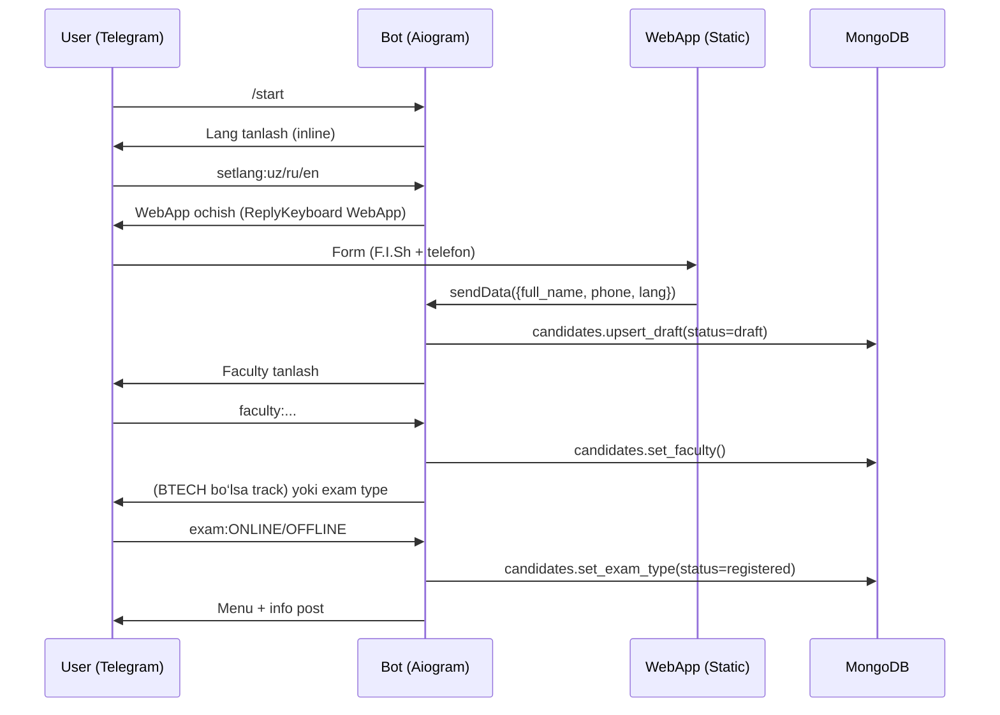
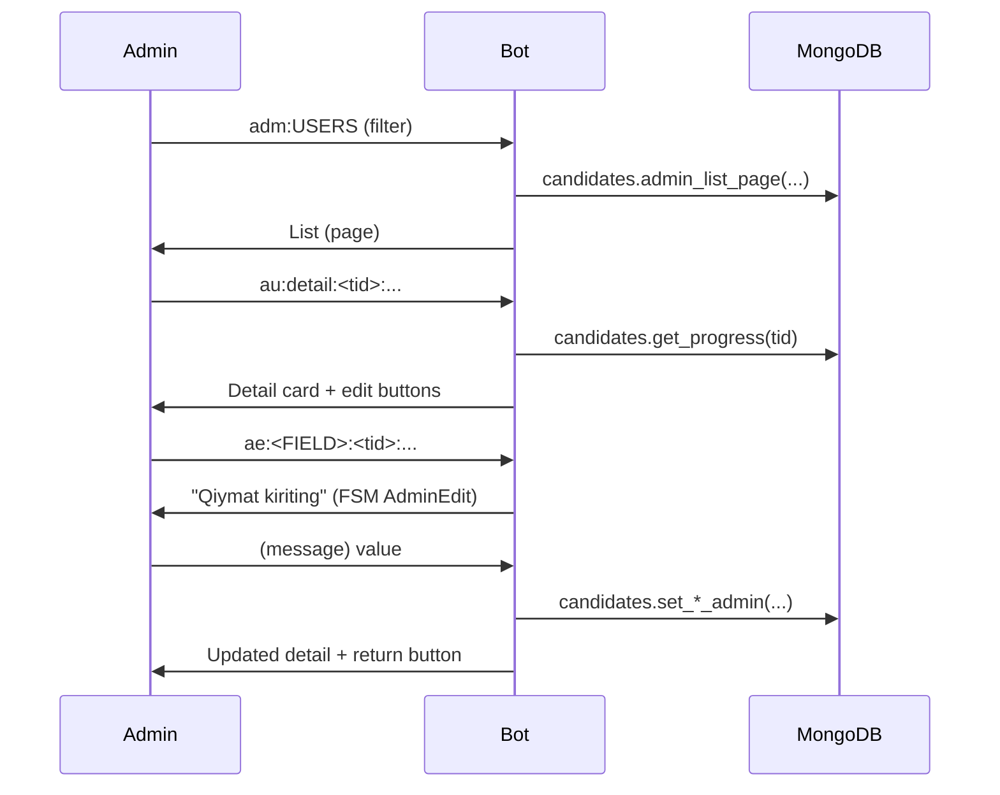

# Architecture

## Umumiy ko‘rinish

Loyiha 4 ta asosiy komponentdan iborat:

1. **Telegram Client** (abituriyent va admin)
2. **Telegram Bot (Aiogram 3)** — `app/bot.py`
3. **MongoDB (Motor async)** — `app/db/...`
4. **Telegram WebApp (Static)** — `app/webapp/`

## Komponentlar diagrammasi

```mermaid
flowchart LR
  U[User/Admin<br/>Telegram App] -->|messages/callbacks| B[Bot: Aiogram 3]
  U -->|WebApp open| W[WebApp: Static HTML/JS/CSS]
  W -->|tg.sendData(payload)| B
  B -->|Motor| M[(MongoDB)]
```

## User ro‘yxatdan o‘tish flow



## Admin flow (Telegram ichida)

Admin router’lar `app/routers/admin/*` ichida.

### Admin menyu (entry)
- `/admin` → admin menu
- `adm:USERS` → filter + paginated list (10 ta)
- `adm:PENDING` → TIME/CREDS/ADDR/ALL bo‘yicha “yetishmayotgan”lar
- `adm:EXPORT` → Excel export filterlari
- `adm:MSG` → telefon/target bo‘yicha xabar
- `adm:BCAST` → broadcast post
- `adm:ADMINS` → super admin uchun admin management

### Admin user detail + edit



## Reminder scheduler (30 daqiqa oldin)

Bot ishga tushganda `reminder_loop()` fon task sifatida ishlaydi:

- `exam_date_time` matnidan `exam_datetime_utc` ni **backfill** qiladi
- Har 60 soniyada:
  - imtihongacha 30 daqiqa qolgan userlarni topadi
  - `reminder_30m` xabarini yuboradi
  - `reminder_30m_sent=true` qilib belgilaydi

```mermaid
flowchart TD
  S[Bot start] --> BF[Backfill exam_datetime_utc]
  BF --> L{Loop каждый 60s}
  L --> Q[find_due_reminders(now_utc..+30m)]
  Q -->|docs| SEND[send_message]
  SEND --> MARK[mark_reminder_sent]
  MARK --> L
```

## Kod tuzilmasi

- `app/bot.py` — entrypoint, dispatcher, middlewares, routers, scheduler loop
- `app/config.py` — `.env` settings (Pydantic Settings)
- `app/db/mongo.py` — Mongo connection
- `app/db/repos/*` — repository layer
- `app/routers/*` — handlers (user + admin)
- `app/keyboards/*` — inline/reply keyboards
- `app/i18n/*.json` — tarjimalar
- `app/webapp/*` — WebApp static UI

## Middleware’lar

- `RoleMiddleware` — `is_admin`, `is_super_admin` flag’larini data context’ga qo‘shadi
- `I18nMiddleware` — `lang` va `t` (translations) ni data context’ga qo‘shadi

## Data injection (Aiogram)

`dp.start_polling(..., users_repo=..., candidates_repo=..., admins_repo=..., translations=...)`

Handler’larda shu argumentlar dependency sifatida olinadi.
